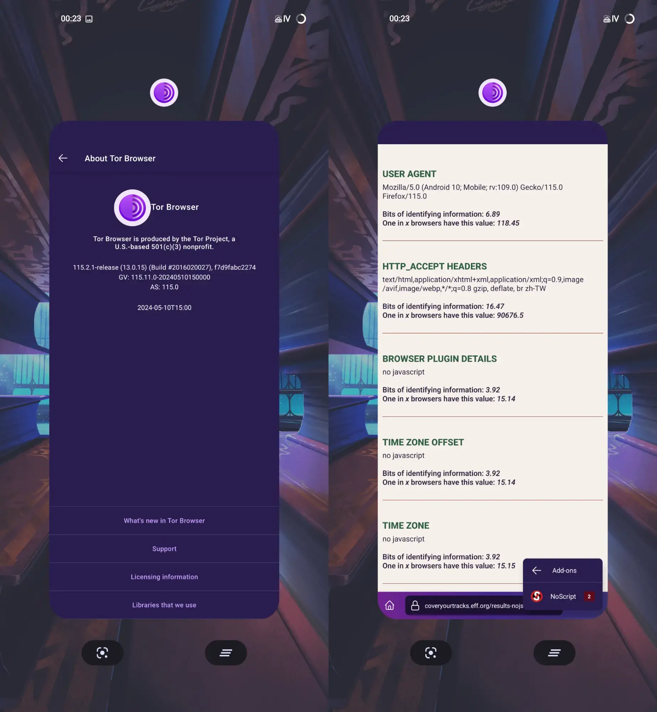
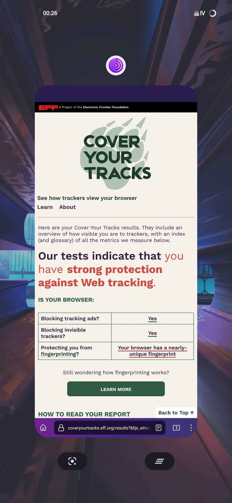

关于Tor信息，请参阅[Wikipedia](https://zh.m.wikipedia.org/zh-cn/Tor)和[Tor Project](https://www.torproject.org/)。

## 0x00.为什么相信我？

你不应该信任任何人，这应该作为使用Tor时必备的常识。
使用Tor非必要时请确保禁用JavaScript，这同样也是常识。

## 0x01.它并不完善

Android版本的Tor从始至终从未完善过......
有许多功能桌面端有，而Android没有，例如：
* HTTP和socks代理功能（在Android上只能通过修改 `about:config` 的方法启用）
* 获取网桥（在桌面端Tor可以直接快捷方便的获取网桥，而Android无此功能，只能选择内置网桥和手动输入网桥）
* 查看Tor路线（在Android无法查看当前连接的Tor路线）
* NoScript可被卸载（是的，你没看错，在Android的Tor上，NoScript可以被卸载）
* 轻易的允许安装浏览器插件（对于Tor浏览器而言，安装浏览器插件是不安全的行为，因其可能会影响浏览器指纹，并且可能做出间谍行为等）
* 还有很多.......

## 0x02.以及一个较为重要的.....

有些时候，Tor甚至不能对抗浏览器指纹识别，而这对于Tor而言是非常致命的。

如图所示，Tor浏览器不知为何在HTTP请求头末尾添加上了 `zh_TW`。

如果开启JavaScript，并重新运行检测，就会惊奇的发现.......

Tor浏览器甚至没有通过EFF的浏览器指纹测试。

然而，在几个月前我使用Android版本的Tor测试，那时候还是能通过EFF的浏览器指纹测试的.........

> 注：图片中壁纸是[PixivID: 119049464](https://www.pixiv.net/artworks/119049464)。

## 0x03.替代方案

说实话，Android真没有太多Tor的替代品，不过您可以试试以及使用Brave浏览器。

我并不是在打广告，而是除了Tor之外能够有效对抗浏览器指纹识别的似乎只有Brave做的比较完善，~~虽然我自己主要使用的浏览器基本都是基于Firefox的~~。
毕竟Brave是和Tor（桌面端）一样无需复杂的配置就可以轻易通过[CoverYourTracks](https://coveryourtracks.eff.org/)测试的浏览器。

如果您需要访问onion站点，无解，请尽可能的避免使用Android端的Tor。

如果您是为了隐私，那么你应该尝试VPN服务，或者刚才提到的Brave浏览器，当然使用基于Firefox的浏览器搭配一些浏览器插件也是不错的选择。

