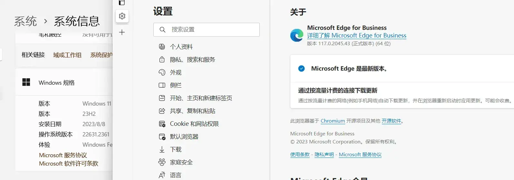

## 0x01 先决条件

首先需要保证您的Edge浏览器以及Windows系统一定是最新版。
在这里我使用了 `Edge 117.0.2045.43 (正式版本) (64 位)` 和 `Windows11 22H2 22631.2361`。如图：

确定您的Edge和Windows版本是最新的之后，您需要在 `设置` -  `时间和语言` - `语言和区域` - `国家和地区` 中更改地区为美国。
当然，更改为其他可以使用Windows Copilot的国家也可以。

以及您需要保证您的网络环境可以使用Windows Copilot，您可以在网络代理软件中使用全局代理。

## 0x02 确保可以正常使用Bing AI

如果您无法使用Bing AI的话，那么您大概率是无法使用Windows Copilot的，因为本质上Windows Copilot就是Bing AI换皮。

而如果您无法使用Bing AI一般是这几种情况:
1. 地址栏域名为`cn.bing.com`。
1. 使用时提示`登录以继续你的聊天`，但是点击后依然没有变化。
1. 提示`出错了。请重试。`或者其他错误信息。
1. 或者其他问题......

第一种问题是你的网络环境的问题，请使用代理。
如果仍然未解决，那么是Edge浏览器认为你在中国，请删除`C:\Users\ <用户文件夹> \AppData\Local\Microsoft\Edge\User Data`这个文件夹
这将会删除你Edge浏览器的所有数据，请注意备份或者云同步你的信息。

至于其他的问题，请将你的地区更改为美国后尝试，如图:

如果仍未解决问题，可以尝试在edge浏览器的设置中退出登录，或者是新建一个InPrivate窗口中与Bing AI对话。
此时如果可以在InPrivate窗口中使用Bing AI，那么代表你和我一样，账户被ban了，解决方法只有两个:
1. 保持未登录状态。
1. 换一个账户。~(顺便一提，E5开发者账户或者企业账户也可以使用企业版。)~

如果你在InPrivate窗口中仍然无法使用Bing AI，那么代表你网络环境有问题，请尝试使用或更换代理。

## 0x03 使用Windows Copilot

此时您应是满足了使用Windows Copilot的条件，您可以尝试重启电脑，此时应该可以在 `设置` -  `个性化` - `任务栏` - `任务栏项` 中看到Copilot的按钮开关了。
或者是使用 win + c 键来打开它。

如果你仍未解决此问题，请手动安装kb5027397启用包，以启用Windows Copilot。
下载kb5027397启用包: [点击这里](https://cloud.saltedfishes.com/Other/启用WindowsCopilot)

## 0x04 注意事项

* Windows Copilot与Edge浏览器相绑定，所以，如果给Edge配置代理，同时也会应用到Windows Copilot上。
其实本质上Windows Copilot就是Bing AI.......

* 请不要使用不干净的IP(例如中国的ip地址)登录bing，这会导致你的账户被ban，这个账户将持续无法使用Windows Copilot和Bing AI。

* Bing AI可以在绝大多数浏览器下正常使用~(这么久了才发现的屑)~
