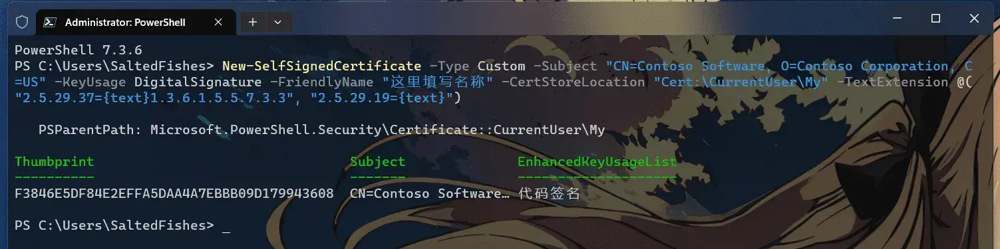
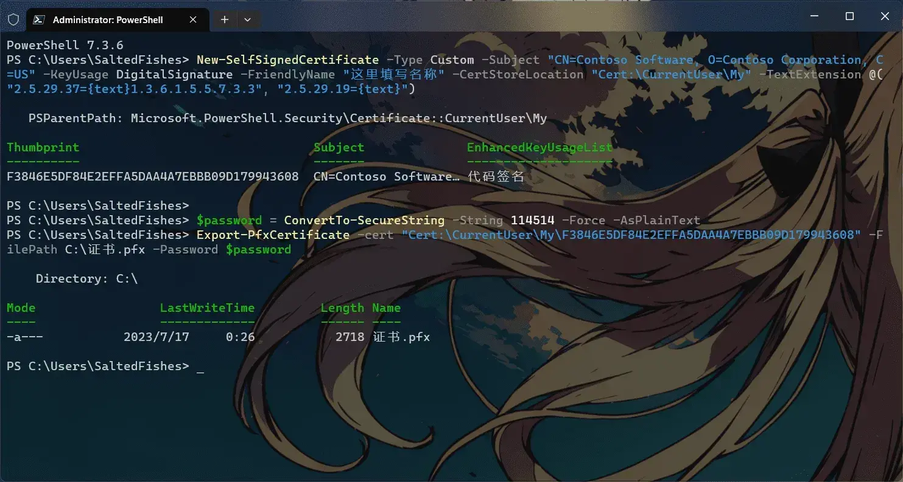
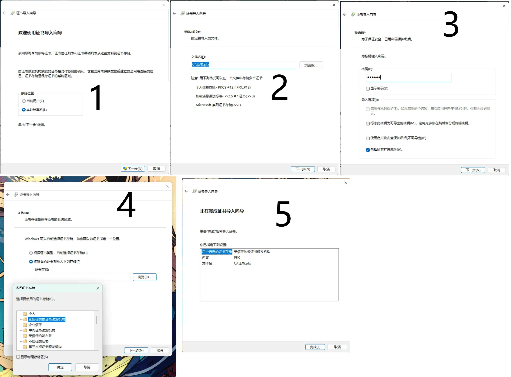

## 0x01.开始之前

本文完全参考微软官方文档: [为程序包签名创建证书](https://learn.microsoft.com/zh-cn/windows/msix/package/create-certificate-package-signing)所写，由于微软官方文档看起来对于新人而言较为复杂，为了方便阅读我对此基础上重写一份比较简单的教程。
所以本文仅面向小白，故不会出现过多具体细节讲解.......

## 0x02.使用 New-SelfSignedCertificate 创建证书

打开PowerShell: 使用win+R键，输入`PowerShell`然后回车。
```PowerShell
New-SelfSignedCertificate -Type Custom -Subject "CN=Contoso Software, O=Contoso Corporation, C=US" -KeyUsage DigitalSignature -FriendlyName "这里填写名称" -CertStoreLocation "Cert:\CurrentUser\My" -TextExtension @("2.5.29.37={text}1.3.6.1.5.5.7.3.3", "2.5.29.19={text}")
```
如果不懂的话可以直接复制粘贴到PowerShell中执行。如图:

在输出结果中复制Thumbprint值(图中的Thumbprint值为F3846E5DF84E2EFFA5DAA4A7EBBB09D179943608)。

## 0x03.导出证书

需要使用指令
```PowerShell
$password = ConvertTo-SecureString -String 密码 -Force -AsPlainText 
Export-PfxCertificate -cert "Cert:\CurrentUser\My\这里填写humbprint值" -FilePath C:\证书.pfx -Password $password
```
需要自行修改指令内容，其中密码指的是导出的.pfx证书的密码。

执行结果如图所示，证书被生成的位置在`C:\证书.pfx`。

## 0x04.让计算机信任该证书

双击刚才生成的.pfx文件.

如图第1步选择`本地计算机`，第3步需要输入.pfx证书的密码，第4步选择`将所有证书都放入下列存储`并浏览选择`受信任的根证书颁发机构`。
