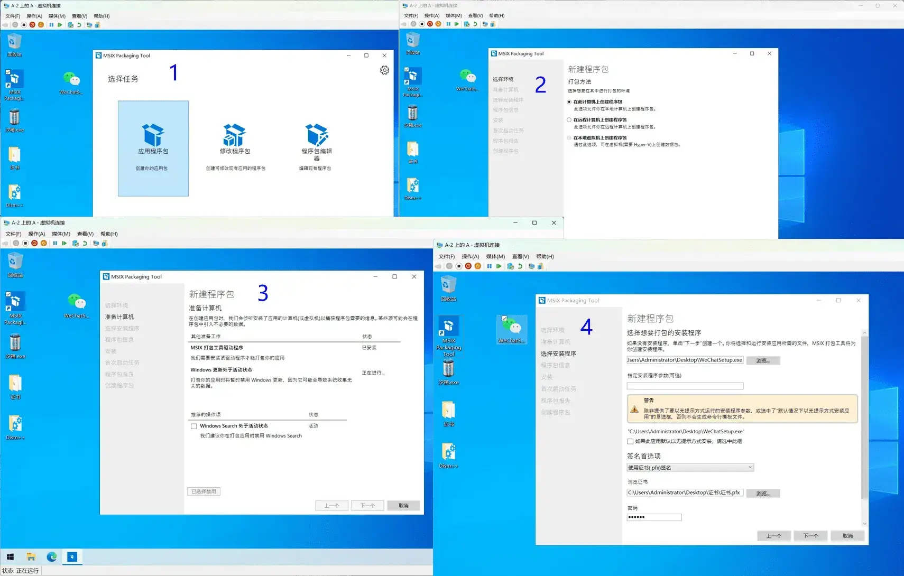
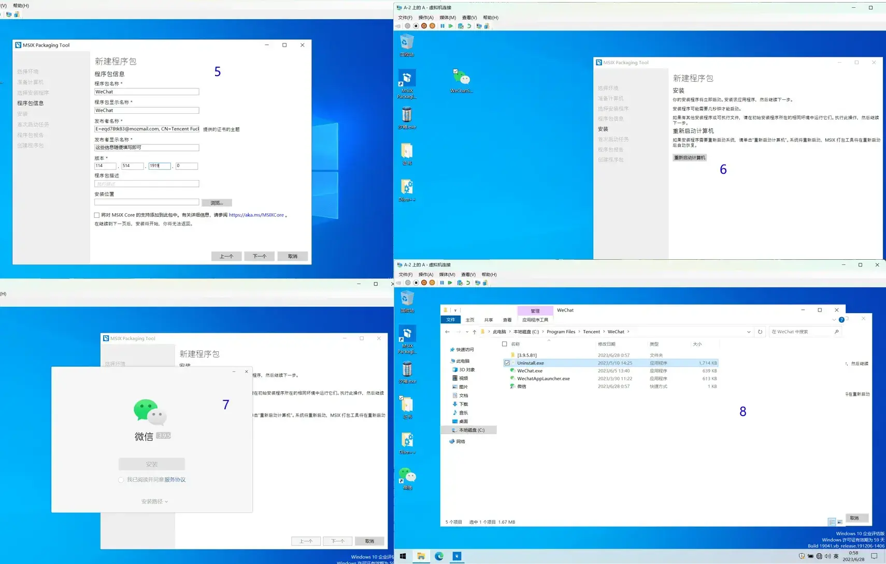
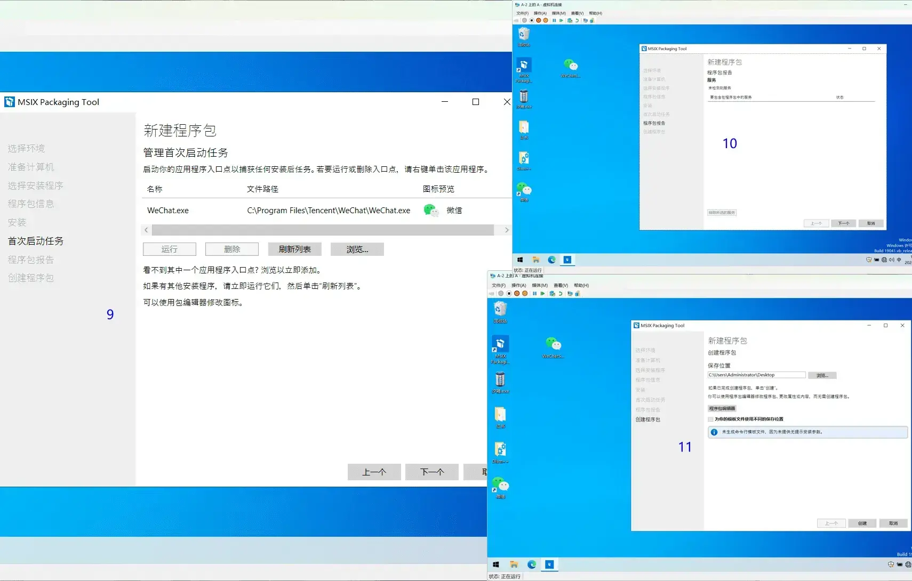
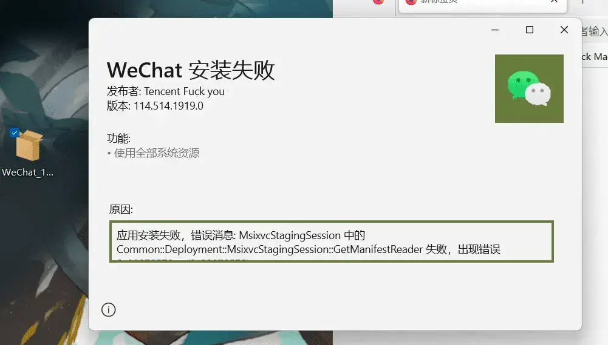
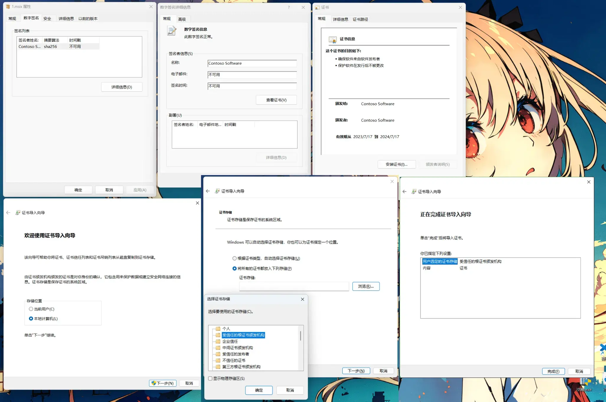

这个标题其实是某些营销号给的灵感，我原本是想以`使用MSIX Packaging Tool将win32封装为UWP`作为标题的.
但是很明显有个问题，读者看到后可能就会因看不懂标题而放弃阅读.........所以就使用这个标题了
毕竟，他们只介绍了微软发布了这个工具却没有介绍如何使用......

## 0x01.介绍

> 本教程适用于Windows10或者Windows11 (理论上封装完成的包(.msix)在Windows7之后的版本都可以使用)

什么是UWP？

* 通用Windows平台 (Universal Windows Platform)，此软件平台的目的是帮助发展Metro样式的应用程序，便于软件可以在Windows 10和Windows 10 Mobile上执行且无需重新编写。

UWP 应用的特点：

1. 安全：UWP 应用声明其访问哪些设备资源和数据 用户必须对该访问授权。
1. 能够在运行 Windows 的所有设备上使用常见的 API。
1. 能够在不对计算机构成风险或引起“计算机损坏”的情况下安装卸载和使用。


##　0x02.准备环境
这里我推荐在虚拟机环境中使用MSIX Packaging Tool将win32封装。
虚拟机的话hyper-v、VirtualBox、VMware都可以
~~至于说虚拟机怎么使用.......嘛，其他人不是写了那么多教程，还请您自己查呢~~
MSIX Packaging Tool只能在Windows10或者Windows11的环境中使用
但是封装时`添加 MSIX Core 的支持`后的包理论上可以在Windows7之后的版本中使用(具体我没测试，我只能保证可以在Windows10和Windows11中使用)。

其实在[Microsoft store](https://apps.microsoft.com/store/detail/msix-packaging-tool/9N5LW3JBCXKF)或者在[GitHub](https://github.com/microsoft/win32-app-isolation)里下载并安装好MSIX Packaging Tool就算是准备好环境了。

## 0x03.封装

从这里开始是本文主要内容

### 1.安装包签名

如果你希望你封装出的msix安装包可以安装，那么这一步必不可少。
可以正常安装签名有两种方法：

1. 使用证书(.pfx)签名 (推荐)

> 这种签名方法请通过自行可以参考微软官方文档: [为程序包签名创建证书](https://learn.microsoft.com/zh-cn/windows/msix/package/create-certificate-package-signing)。
如果看不懂也没关系，可以参考我写的这一篇: [为程序包(MSIX)签名创建证书(.pfx)](/create-certificate-package-signing/)。

2. 使用Device Guard签名版本2进行签名 (不推荐)

> 这里需要使用工作或者学习账户登录进行授权，这里可以使用E5管理员账户登录

至于说时间戳服务器URL，这里我推荐填写`http://timestamp.digicert.com/scripts/timestamp`，当然你也可以不填写，基本不会影响使用。

### 2.打包（使用WeChat举例）

如图第2和第3步直接选择下一个即可，第4步时请选择你要打包的软件的安装程序，并且配置好安装包签名


---

第5步时参数可以随便填写，并不会有任何使用上的区别。
但是如需在较老版本的Windows中使用请勾选`将对 MSIX Core 的支持添加到包中`并选择合适的版本。
第6步时需要等待一小会，会自动弹出安装程序。如第7步所示，直接按照正常安装流程安装即可。
不过安装完成后我推荐运行一次程序，然后关闭，再打开安装目录，将多余的程序删除（例如卸载程序，这对于UWP来说没有用）
以及删除文件的时候记得清空回收站


---

到这一步可能需要加载一段时间，加载完成后如果和图中第9步类似就代表您基本上成功了，如果没有请检查之前的步骤是否正确。
第9、10、11步一般情况下直接选择下一个就可以，一般情况下这里不需要配置，默认即可。


## 0x04.安装

如果你做到此步，其实是可以直接安装的。

如果发现MSIX Packaging Tool生成的安装包无法直接安装，如图所示：

实际上这是由于Windows安装软件时会校验安装包签名，而您配置证书的时候错误配置了，导致Windows不认识这个证书，自然就拒绝安装了。

如果是Windows11，那么解决方法很简单，使用PowerShell安装，命令如下

```PowerShell
Add-AppPackage -Path "这里填写安装包的名称和路径" -AllowUnsigned
```

<details>
  <summary>不会PowerShell？</summary><blockquote>
  使用win+R键，输入<code>PowerShell</code>然后回车，输入如上指令，然后回车
  <br><br>
</blockquote></details><br>

---

如果不是Windows11的话，可以尝试以下步骤:
右键选择属性，如图:

在属性选项卡选择`数字签名`，选中其中的一条，选择`详情信息`，再选择`查看证书`。
在证书页面中选择`安装证书`，选择`本地计算机`，并点击下一步。选择`将所有证书都放入下列存储`并浏览选择`受信任的根证书颁发机构`即可。

---

### 至此，恭喜🎉，您已经完成了将程序封装从UWP的到安装使用所有步骤。

## 0x05.其他

1. 注意：`0x03封装`的安装过程中应用安装完成后请启动应用一次，以确保应用可以运行(因为部分应用实际上是需要启动一次才可以真正完成安装)
1. 封装过程中请尽量不要干其他无关事情(尽量保证后台无其它程序)。
1. 如果非必要，我推荐断网封装，这样可以有效阻止热更新以节省空间。
1. 其实第10步时，如果有`要从程序包排除的服务`的一栏选项，推荐勾选上(因为绝大多数情况出现这一栏代表你后台可能运行无关程序了)
1. 再次强调，如需在较老版本的Windows(例如Windows7)中使用请勾选`将对 MSIX Core 的支持添加到包中`并选择合适的版本。
1. .......或许还有更多需要注意的.....以后想到了再补充.........

以及......我的网盘中存在一些我个人已经封装好的（推荐使用PowerShell安装）

> https://cloud.saltedfishes.com/zh-CN/UWP/
